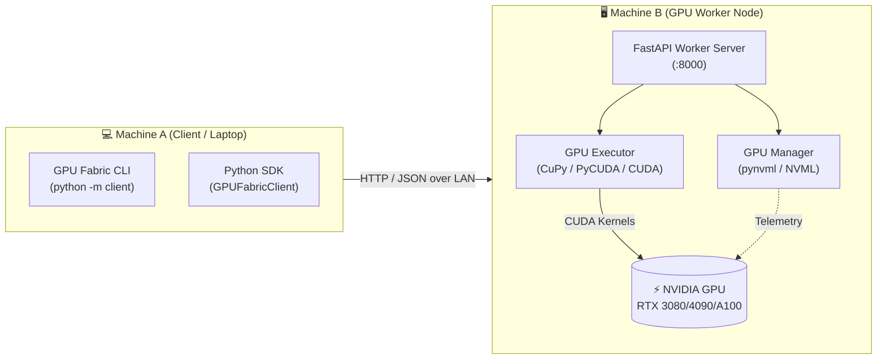

<div align="center">

# ⚡ GPU Fabric

**Discover, access, and control GPUs across machines on your local network.**

Turn networked machines with NVIDIA GPUs into a unified, accessible GPU compute fabric.

---

[](https://github.com/Izpiz06/gpufabric/actions/workflows/ci.yml)
[](https://github.com/Izpiz06/gpufabric/actions/workflows/build.yml)
[](https://pypi.org/project/gpufabric/)
[](LICENSE)
[](https://fastapi.tiangolo.com)
[](https://developer.nvidia.com/cuda-toolkit)

</div>

---

## 📌 Table of Contents

- [Overview](#-overview)
- [Key Features](#-key-features)
- [Architecture](#-architecture)
- [Installation](#-installation)
- [Quickstart Guide](#-quickstart-guide)
  - [1. Launch Worker (GPU Node)](#1-launch-worker-gpu-node)
  - [2. Use Client CLI (Client Node)](#2-use-client-cli-client-node)
- [CLI Showcase](#-cli-showcase)
- [Python SDK](#-python-sdk)
- [Worker API Reference](#-worker-api-reference)
- [Project Layout](#-project-layout)
- [Testing & Quality](#-testing--quality)
- [Roadmap](#-roadmap)
- [License](#-license)

---

## 🚀 Overview

**GPU Fabric** is a lightweight, high-performance distributed GPU runtime designed for local networks. Instead of managing complex orchestration clusters or cloud virtual machines, GPU Fabric allows you to run workloads directly on remote GPUs across your LAN with minimal overhead.

> 🎯 **Phase 1 Prototype**: Focused on direct client-to-worker discovery, hardware telemetry, and remote GPU kernel execution ($C = A + B$) with zero CPU faking.

---

## ✨ Key Features

* 🔍 **Zero-Friction Discovery**: Query any worker node over LAN to inspect hardware specs and cluster readiness.
* 📊 **Live NVML Telemetry**: Real-time VRAM allocation, GPU core utilization, memory controller load, and temperatures via NVIDIA NVML.
* ⚡ **Physical GPU Kernel Execution**: Workloads execute directly on physical GPU memory via **CuPy**, **PyCUDA**, or **PyTorch CUDA** (no CPU fallback).
* 🖥️ **Rich Interactive CLI**: Built-in formatted terminal user interface with status indicators, tables, and execution metrics.
* 🐍 **Modern Python SDK & REST API**: Type-safe Pydantic v2 schemas and native async HTTP client.

---

## 🏗️ Architecture



---

## 📦 Installation

### Prerequisites
* Python **3.9+**
* Linux / Windows / macOS (Client can run on any OS; Worker requires an NVIDIA GPU with drivers installed)

### 1. Clone & Install Core Package
```bash
git clone https://github.com/Izpiz06/gpufabric.git
cd gpufabric

pip install -r requirements.txt
pip install -e .
```

### 2. Install GPU Backend (On Worker Machine)
Install your preferred CUDA backend matching your installed NVIDIA driver:

```bash
# Recommended: CuPy for CUDA 12.x
pip install cupy-cuda12x

# Or CuPy for CUDA 11.x
pip install cupy-cuda11x

# Or PyCUDA
pip install pycuda
```

---

## ⚡ Quickstart Guide

### 1. Launch Worker (GPU Node)

Run the worker on the machine containing the NVIDIA GPU:

```bash
python -m worker --host 0.0.0.0 --port 8000
```

*Flags:*
* `--host`: Interface IP to bind (default: `0.0.0.0`)
* `--port`: Port number (default: `8000`)
* `--worker-id`: Custom name/tag for the worker node
* `--log-level`: `debug`, `info`, `warning`, `error`

---

### 2. Use Client CLI (Client Node)

From another machine on the LAN (e.g., your laptop):

#### 📡 Discover & Ping Worker
```bash
python -m client discover 192.168.1.50
```

#### 🔍 Query Hardware Specifications
```bash
python -m client gpu 192.168.1.50 --device 0
```

#### 📈 Real-Time GPU Status & Telemetry
```bash
python -m client status 192.168.1.50
```

#### 🚀 Execute Vector Addition ($C = A + B$) on Remote GPU
```bash
# Custom vectors:
python -m client execute 192.168.1.50 --a 1.0 2.0 3.0 4.0 --b 10.0 20.0 30.0 40.0

# Or benchmark with 1,000,000 elements:
python -m client execute 192.168.1.50 --size 1000000
```

---

## 💻 CLI Showcase

### `python -m client gpu <worker-ip>`
```text
┌──────────────────── GPU Information (Device 0) ────────────────────┐
│ Property            │ Value                                       │
├─────────────────────┼─────────────────────────────────────────────┤
│ GPU Model           │ NVIDIA GeForce RTX 4090                     │
│ Device Index        │ 0                                           │
│ Total VRAM          │ 24.00 GiB (25,769,803,776 bytes)            │
│ Free VRAM           │ 21.84 GiB (23,450,288,128 bytes)            │
│ Used VRAM           │ 2.16 GiB (2,319,515,648 bytes)              │
│ Compute Capability  │ 8.9                                         │
│ Driver Version      │ 550.54.14                                   │
└───────────────────────────────────────────────────────────────────┘
```

### `python -m client status <worker-ip>`
```text
┌────────────────────── Live GPU Status (Device 0) ──────────────────┐
│ Metric                        │ Value                             │
├───────────────────────────────┼───────────────────────────────────┤
│ GPU Core Utilization          │ 18%                               │
│ Memory Controller Utilization │ 6%                                │
│ Free VRAM                     │ 21.84 GiB                         │
│ Used VRAM                     │ 2.16 GiB                          │
│ Temperature                   │ 48 °C                             │
│ Active Tasks                  │ 0                                 │
└───────────────────────────────────────────────────────────────────┘
```

### `python -m client execute <worker-ip> --a 1 2 3 --b 4 5 6`
```text
Executing Workload: C = A + B (vector size: 3)
  Vector A: [1.0, 2.0, 3.0]
  Vector B: [4.0, 5.0, 6.0]

┌────────────────────── Execution Result ───────────────────────────┐
│ Property       │ Value                                            │
├────────────────┼──────────────────────────────────────────────────┤
│ Task ID        │ 8f94d8b2-5712-4cf0-8bb2-31c3bf1ef218             │
│ Workload       │ vector_add                                       │
│ Status         │ success                                          │
│ Device Index   │ 0                                                │
│ GPU Backend    │ cupy                                             │
│ Execution Time │ 0.2840 ms                                        │
└──────────────────────────────────────────────────────────────────┘
  Result Vector C: [5.0, 7.0, 9.0]
```

---

## 🐍 Python SDK

Use `GPUFabricClient` directly within your Python applications:

```python
from client import GPUFabricClient

# Connect to the remote worker
with GPUFabricClient(host="192.168.1.50", port=8000) as client:
    # 1. Health check
    health = client.health()
    print(f"Worker: {health.worker_id} (GPU Available: {health.gpu_available})")

    # 2. Inspect GPU
    gpu = client.get_gpu_info(device_index=0)
    print(f"Found GPU: {gpu.name} with {gpu.total_vram_human} VRAM")

    # 3. Stream status
    status = client.get_status(device_index=0)
    print(f"Current GPU Load: {status.gpu_utilization_pct}%, Temp: {status.temperature_c}°C")

    # 4. Offload computation to remote GPU
    response = client.execute_vector_add(
        a=[10.0, 20.0, 30.0, 40.0],
        b=[0.5, 1.5, 2.5, 3.5],
        device_index=0,
    )
    print(f"Output: {response.result}")
    print(f"Kernel Time: {response.execution_time_ms} ms via {response.gpu_backend}")
```

---

## 🔌 Worker API Reference

The worker exposes a REST API via FastAPI:

| Method | Endpoint | Description | Query / Body Parameters |
|:---|:---|:---|:---|
| `GET` | `/health` | Node health & GPU readiness | None |
| `GET` | `/gpu` | Static GPU specs & memory capacity | `?device_index=0` |
| `GET` | `/status` | Dynamic GPU load, temp & active tasks | `?device_index=0` |
| `POST` | `/execute` | Execute compute kernel on GPU | `{"workload_type": "vector_add", "a": [...], "b": [...], "device_index": 0}` |

---

## 📁 Project Layout

```text
gpufabric/
├── .github/workflows/
│   ├── ci.yml            # Multi-Python test matrix (3.9 - 3.13) & Ruff linting
│   └── build.yml         # Wheel packaging & prebuild distribution artifacts
├── client/
│   ├── __init__.py       # Exports GPUFabricClient
│   ├── client.py         # Python client library
│   ├── cli.py            # Rich CLI interface
│   └── __main__.py       # python -m client entrypoint
├── worker/
│   ├── __init__.py       # Exports create_app, GPUManager, GPUExecutor
│   ├── app.py            # FastAPI worker application & endpoints
│   ├── gpu.py            # NVML hardware inspection & monitoring
│   ├── executor.py       # Real GPU kernel execution (CuPy / PyCUDA / Torch)
│   ├── server.py         # Worker CLI runner
│   └── __main__.py       # python -m worker entrypoint
├── common/
│   ├── __init__.py
│   ├── models.py         # Pydantic v2 data models for API contracts
│   └── protocol.py       # Constants, endpoints, formatting helpers
├── tests/
│   ├── test_client.py    # Client API & discovery unit tests
│   ├── test_common.py    # Protocol serialization tests
│   ├── test_executor.py  # GPU executor validation tests
│   ├── test_gpu_manager.py # NVML monitoring tests
│   └── test_worker_api.py# FastAPI routes & integration tests
├── pyproject.toml        # PEP 517/621 build configuration
├── requirements.txt      # Core dependencies
└── README.md
```

---

## 🧪 Testing & Quality

Run the automated test suite:
```bash
pytest -v
```

Run code quality and style checks:
```bash
ruff check .
```

---

## 🗺️ Roadmap

- [x] **Phase 1**: Single-node Client-Worker prototype, NVML telemetry, vector addition on GPU.
- [ ] **Phase 2**: Automatic LAN multicast/mDNS node discovery and multi-GPU node aggregation.
- [ ] **Phase 3**: Tensor operations & custom CUDA kernel dispatch over network streams.
- [ ] **Phase 4**: Dynamic workload scheduling, memory pooling, and fault tolerance.

---

## 📄 License

This project is licensed under the [Apache-2.0 License](LICENSE).
