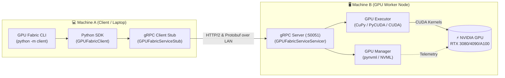

<div align="center">

# ⚡ GPU Fabric

**Discover, access, and control GPUs across machines on your local network via gRPC.**

Turn networked machines with NVIDIA GPUs into a unified, high-performance GPU compute fabric.

---

[](https://github.com/Izpiz06/gpufabric/actions/workflows/ci.yml)
[](https://github.com/Izpiz06/gpufabric/actions/workflows/build.yml)
[](https://pypi.org/project/gpufabric/)
[](LICENSE)
[](https://grpc.io)
[](https://developer.nvidia.com/cuda-toolkit)

</div>

---

## 📌 Table of Contents

- [Overview](#-overview)
- [Key Features](#-key-features)
- [Architecture](#-architecture)
- [Installation](#-installation)
- [Quickstart Guide](#-quickstart-guide)
  - [1. Launch Worker (GPU Node)](#1-launch-worker-gpu-node)
  - [2. Use Client CLI (Client Node)](#2-use-client-cli-client-node)
- [CLI Showcase](#-cli-showcase)
- [Python SDK](#-python-sdk)
- [gRPC Service Definition](#-grpc-service-definition)
- [Project Layout](#-project-layout)
- [Testing & Quality](#-testing--quality)
- [Roadmap](#-roadmap)
- [License](#-license)

---

## 🚀 Overview

**GPU Fabric** is a lightweight, high-performance distributed GPU runtime designed for local networks. Instead of heavy orchestration stacks or cloud dependencies, GPU Fabric uses **gRPC with Protocol Buffers** to provide ultra-low latency remote GPU access and workload dispatch across your LAN.

> 🎯 **Phase 1 Prototype**: Focused on direct client-to-worker gRPC discovery, hardware telemetry, and remote GPU kernel execution ($C = A + B$) with zero CPU faking.

---

## ✨ Key Features

* 🚀 **gRPC & Protocol Buffers**: High-speed, strongly typed binary RPC protocol.
* 🔍 **Zero-Friction Discovery**: Connect to any worker over LAN to inspect hardware specs and cluster readiness.
* 📊 **Live NVML Telemetry**: Real-time VRAM allocation, GPU core utilization, memory controller load, and temperatures via NVIDIA NVML.
* ⚡ **Physical GPU Kernel Execution**: Workloads execute directly on physical GPU memory via **CuPy**, **PyCUDA**, or **PyTorch CUDA** (no CPU fallback).
* 🖥️ **Rich Interactive CLI**: Built-in formatted terminal user interface with status indicators, tables, and execution metrics.
* 🧩 **Modular & Clean Architecture**: Codebase is split into single-responsibility, maintainable sub-modules.

---

## 🏗️ Architecture



---

## 📦 Installation

### Prerequisites
* Python **3.9+**
* Linux / Windows / macOS (Client runs on any OS; Worker requires an NVIDIA GPU with drivers installed)

### 1. Clone & Install Core Package
```bash
git clone https://github.com/Izpiz06/gpufabric.git
cd gpufabric

pip install -r requirements.txt
pip install -e .
```

### 2. Install GPU Backend (On Worker Machine)
Install your preferred CUDA backend matching your NVIDIA driver:

```bash
# Recommended: CuPy for CUDA 12.x
pip install cupy-cuda12x

# Or CuPy for CUDA 11.x
pip install cupy-cuda11x

# Or PyCUDA
pip install pycuda
```

---

## ⚡ Quickstart Guide

### 1. Launch Worker (GPU Node)

Run the worker on the machine containing the NVIDIA GPU:

```bash
python -m worker --host 0.0.0.0 --port 50051
```

*Flags:*
* `--host`: Interface IP to bind (default: `0.0.0.0`)
* `--port`: Port number (default: `50051`)
* `--worker-id`: Custom name/tag for the worker node
* `--log-level`: `debug`, `info`, `warning`, `error`

---

### 2. Use Client CLI (Client Node)

From another machine on the LAN (e.g., your laptop):

#### 📡 Discover & Ping Worker
```bash
python -m client discover 192.168.1.50
```

#### 🔍 Query Hardware Specifications
```bash
python -m client gpu 192.168.1.50 --device 0
```

#### 📈 Real-Time GPU Status & Telemetry
```bash
python -m client status 192.168.1.50
```

#### 🚀 Execute Vector Addition ($C = A + B$) on Remote GPU
```bash
# Custom vectors:
python -m client execute 192.168.1.50 --a 1.0 2.0 3.0 4.0 --b 10.0 20.0 30.0 40.0

# Or benchmark with 1,000,000 elements:
python -m client execute 192.168.1.50 --size 1000000
```

---

## 💻 CLI Showcase

### `python -m client gpu <worker-ip>`
```text
┌──────────────────── GPU Information (Device 0) ────────────────────┐
│ Property            │ Value                                       │
├─────────────────────┼─────────────────────────────────────────────┤
│ GPU Model           │ NVIDIA GeForce RTX 4090                     │
│ Device Index        │ 0                                           │
│ Total VRAM          │ 24.00 GiB (25,769,803,776 bytes)            │
│ Free VRAM           │ 21.84 GiB (23,450,288,128 bytes)            │
│ Used VRAM           │ 2.16 GiB (2,319,515,648 bytes)              │
│ Compute Capability  │ 8.9                                         │
│ Driver Version      │ 550.54.14                                   │
└───────────────────────────────────────────────────────────────────┘
```

### `python -m client status <worker-ip>`
```text
┌────────────────────── Live GPU Status (Device 0) ──────────────────┐
│ Metric                        │ Value                             │
├───────────────────────────────┼───────────────────────────────────┤
│ GPU Core Utilization          │ 18%                               │
│ Memory Controller Utilization │ 6%                                │
│ Free VRAM                     │ 21.84 GiB                         │
│ Used VRAM                     │ 2.16 GiB                          │
│ Temperature                   │ 48 °C                             │
│ Active Tasks                  │ 0                                 │
└───────────────────────────────────────────────────────────────────┘
```

### `python -m client execute <worker-ip> --a 1 2 3 --b 4 5 6`
```text
Executing Workload: C = A + B (size: 3)
  Vector A: [1.0, 2.0, 3.0]
  Vector B: [4.0, 5.0, 6.0]

┌────────────────────── Execution Result ───────────────────────────┐
│ Property       │ Value                                            │
├────────────────┼──────────────────────────────────────────────────┤
│ Task ID        │ 8f94d8b2-5712-4cf0-8bb2-31c3bf1ef218             │
│ Workload       │ vector_add                                       │
│ Status         │ success                                          │
│ GPU Backend    │ cupy                                             │
│ Execution Time │ 0.2840 ms                                        │
└──────────────────────────────────────────────────────────────────┘
  Result Vector C: [5.0, 7.0, 9.0]
```

---

## 🐍 Python SDK

Use `GPUFabricClient` directly within your Python applications:

```python
from client import GPUFabricClient

# Connect to the remote worker via gRPC
with GPUFabricClient(host="192.168.1.50", port=50051) as client:
    # 1. Health check
    health = client.health()
    print(f"Worker: {health.worker_id} (GPU Available: {health.gpu_available})")

    # 2. Inspect GPU
    gpu = client.get_gpu_info(device_index=0)
    print(f"Found GPU: {gpu.name} with {gpu.total_vram_human} VRAM")

    # 3. Live status
    status = client.get_status(device_index=0)
    print(f"GPU Load: {status.gpu_utilization_pct}%, Temp: {status.temperature_c}°C")

    # 4. Offload computation to remote GPU
    response = client.execute_vector_add(
        a=[10.0, 20.0, 30.0, 40.0],
        b=[0.5, 1.5, 2.5, 3.5],
        device_index=0,
    )
    print(f"Output: {list(response.result)}")
    print(f"Kernel Time: {response.execution_time_ms} ms via {response.gpu_backend}")
```

---

## 📜 gRPC Service Definition

Defined in [`proto/gpufabric.proto`](proto/gpufabric.proto):

```protobuf
syntax = "proto3";

package gpufabric;

service GPUFabricService {
  rpc GetHealth(HealthRequest) returns (HealthResponse);
  rpc GetGPUInfo(GPUInfoRequest) returns (GPUInfoResponse);
  rpc GetGPUStatus(GPUStatusRequest) returns (GPUStatusResponse);
  rpc Execute(ExecuteRequest) returns (ExecuteResponse);
}
```

---

## 📁 Project Layout

```text
gpufabric/
├── proto/
│   └── gpufabric.proto       # Service & message definitions
├── client/
│   ├── __init__.py           # Exports GPUFabricClient
│   ├── client.py             # Core gRPC Python client SDK
│   ├── commands.py           # CLI sub-command handlers
│   ├── formatters.py         # Rich terminal output formatters
│   ├── cli.py                # Argument parsing & dispatch
│   └── __main__.py           # python -m client entrypoint
├── worker/
│   ├── __init__.py           # Exports worker components
│   ├── state.py              # Worker metadata & active task state
│   ├── gpu.py                # NVML device discovery & telemetry
│   ├── executor.py           # Physical GPU kernel execution
│   ├── service.py            # gRPC Servicer implementation
│   ├── server.py             # gRPC Server initialization & CLI
│   └── __main__.py           # python -m worker entrypoint
├── common/
│   ├── __init__.py
│   ├── gpufabric_pb2.py      # Generated protobuf classes
│   ├── gpufabric_pb2_grpc.py # Generated gRPC stubs & servicer
│   ├── constants.py          # Port & version constants
│   └── formatting.py         # Human-readable formatters
├── tests/
│   ├── test_client.py        # Client gRPC tests
│   ├── test_common.py        # Protocol & formatting tests
│   ├── test_executor.py      # GPU execution validation
│   ├── test_gpu_manager.py   # NVML monitoring tests
│   └── test_grpc_service.py  # gRPC Servicer unit tests
├── pyproject.toml
├── requirements.txt
└── README.md
```

---

## 🧪 Testing & Quality

Run the automated test suite:
```bash
pytest -v
```

Run code formatting and linting:
```bash
ruff check .
```

---

## 🗺️ Roadmap

- [x] **Phase 1**: Single-node Client-Worker prototype, gRPC + Protobuf protocol, NVML telemetry, GPU vector addition.
- [ ] **Phase 2**: Automatic LAN multicast/mDNS node discovery and multi-GPU node aggregation.
- [ ] **Phase 3**: Tensor operations & custom CUDA kernel dispatch over network streams.
- [ ] **Phase 4**: Dynamic workload scheduling, memory pooling, and fault tolerance.

---

## 📄 License

This project is licensed under the [Apache-2.0 License](LICENSE).
