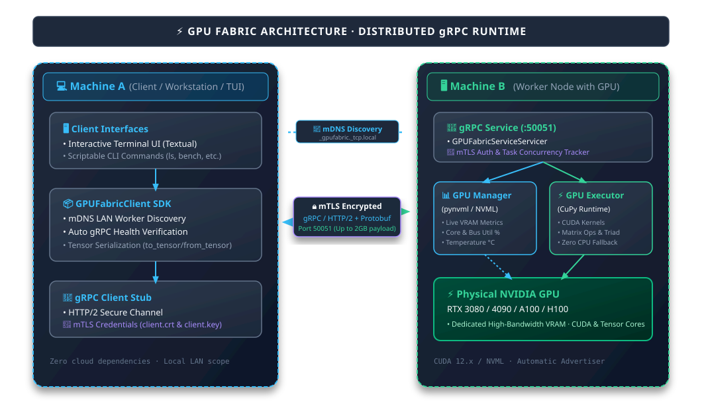

<div align="center">

# ⚡ GPU Fabric

**Discover, access, and control GPUs across machines on your local network via gRPC.**

Turn networked machines with NVIDIA GPUs into a unified, high-performance GPU compute fabric.

---

[](https://github.com/Izpiz06/gpufabric/actions/workflows/ci.yml)
[](https://github.com/Izpiz06/gpufabric/actions/workflows/build.yml)
[](https://pypi.org/project/gpufabric/)
[](LICENSE)
[](https://grpc.io)
[](https://developer.nvidia.com/cuda-toolkit)

</div>

---

## 📌 Table of Contents

- [Overview](#-overview)
- [Key Features](#-key-features)
- [Architecture](#-architecture)
- [Installation](#-installation)
- [📖 How to Use](#-how-to-use)
  - [Step 0: Setup Mutual TLS Certificates](#step-0-setup-mutual-tls-certificates-recommended)
  - [Step 1: Start the GPU Worker Node](#step-1-start-the-gpu-worker-node)
  - [Step 2: Use the Client CLI](#step-2-use-the-client-cli)
  - [Step 3: Use the Python SDK](#step-3-use-the-python-sdk)
- [💻 CLI Command Showcase](#-cli-command-showcase)
- [🧪 How to Test](#-how-to-test)
  - [1. Run Automated Unit Tests](#1-run-automated-unit-tests)
  - [2. Run Remote GPU Hardware Integration Tests](#2-run-remote-gpu-hardware-integration-tests)
  - [3. Code Linting & Style Verification](#3-code-linting--style-verification)
  - [4. Regenerating gRPC Code](#4-regenerating-grpc-code)
  - [5. Worker Benchmarks & Stress Tests](#5-worker-benchmarks--stress-tests)
  - [6. Continuous Integration (CI) Test Pipeline](#6-continuous-integration-ci-test-pipeline)
- [🔌 gRPC Service Definition](#-grpc-service-definition)
- [📁 Project Layout](#-project-layout)
- [🗺️ Roadmap](#-roadmap)
- [📄 License](#-license)

---

## 🚀 Overview

**GPU Fabric** is a lightweight, high-performance distributed GPU runtime designed for local networks. Instead of heavy orchestration stacks or cloud dependencies, GPU Fabric uses **gRPC with Protocol Buffers** to provide ultra-low latency remote GPU access and workload dispatch across your LAN.

> 🎯 **Phase 1 Prototype**: Focused on direct client-to-worker gRPC discovery, hardware telemetry, tensor computations (`matmul`, `vector_add`, `vector_dot`, `triad`), and remote GPU kernel execution with zero CPU faking.

---

## ✨ Key Features

* 🚀 **gRPC & Protocol Buffers**: High-speed, strongly typed binary RPC protocol over HTTP/2.
* 🔍 **Zero-Friction Discovery**: Connect to any worker over LAN to inspect hardware specs and cluster readiness.
* 📊 **Live NVML Telemetry**: Real-time VRAM allocation, GPU core utilization, memory controller load, and temperatures via NVIDIA NVML.
* ⚡ **Physical GPU Kernel Execution**: Workloads execute directly on physical GPU memory via **CuPy** (no CPU fallback).
* 🔐 **Mutual TLS by Default**: Traffic is encrypted and workers only accept clients holding a certificate signed by your CA.
* 🖥️ **Rich Interactive CLI**: Built-in formatted terminal user interface with status indicators, tables, and execution metrics.
* 🧩 **Modular & Clean Architecture**: Codebase is split into single-responsibility, maintainable sub-modules.

---

## 🏗️ Architecture

<div align="center">



<sub>*Excalidraw diagram source available at [`assets/architecture.excalidraw`](assets/architecture.excalidraw) (open on [excalidraw.com](https://excalidraw.com)).*</sub>

</div>

---

## 📦 Installation

### Prerequisites
* Python **3.10+**
* Linux / Windows / macOS (Client runs on any OS; Worker requires an NVIDIA GPU with drivers installed)

### 1. Clone & Install Core Package
```bash
git clone https://github.com/Izpiz06/gpufabric.git
cd gpufabric

pip install -r requirements.txt
pip install -e .
```

### 2. Install CuPy (On Worker Machine)
The worker runs GPU workloads through [CuPy](https://cupy.dev). Install the build matching your installed CUDA toolkit/driver version:

```bash
# CUDA 12.x
pip install cupy-cuda12x

# CUDA 13.x
pip install cupy-cuda13x
```

> [!TIP]
> If the CUDA Toolkit isn't installed system-wide, you can install the required CUDA runtime, NVRTC, and cuBLAS pip packages:
> ```bash
> pip install nvidia-cuda-runtime-cu12 nvidia-cuda-nvrtc-cu12 nvidia-cublas-cu12
> ```

---

## 📖 How to Use

### Step 0: Setup Mutual TLS Certificates (Recommended)

GPU Fabric secures communication between clients and workers using **mutual TLS (mTLS)**.

1. **On the Worker Machine**, initialize the Certificate Authority (CA) and server certificate. By default, it automatically detects all local network addresses and hostnames:
   ```bash
   gpufabric-certs init
   ```
   Or optionally specify explicit IP(s) or hostname(s) with `--hosts`:
   ```bash
   gpufabric-certs init --hosts 192.168.1.50,gpu-box
   ```
   This generates certificates in `~/.config/gpufabric/tls/`.

2. **Generate a Client Certificate Bundle**:
   ```bash
   gpufabric-certs add-client my-laptop
   ```

3. **Copy the Client Bundle to the Client Machine**:
   Copy `~/.config/gpufabric/tls/clients/my-laptop/{ca.crt,client.crt,client.key}` to `~/.config/gpufabric/tls/` on your laptop.

*(For local testing without encryption, you can pass `--insecure` to both the worker and client).*

---

### Step 1: Start the GPU Worker Node

On the machine with the NVIDIA GPU, start the gRPC worker service:

```bash
# Using module entry point:
python -m worker --host 0.0.0.0 --port 50051

# Or using the installed binary:
gpufabric-worker --host 0.0.0.0 --port 50051
```

#### Worker Flags & Options:
| Flag | Default | Description |
|---|---|---|
| `--host` | `0.0.0.0` | Host IP interface to bind |
| `--port` | `50051` | Port number to listen on |
| `--worker-id` | hostname | Custom identifier for the worker node |
| `--log-level` | `info` | Logging verbosity (`debug`, `info`, `warning`, `error`) |
| `--max-message-mb` | `256` | Maximum gRPC message size in MiB (up to 2047) |
| `--tls-dir` | `~/.config/gpufabric/tls` | Path to TLS certificate directory |
| `--insecure` | `false` | Run without mTLS encryption (plaintext, dev-only) |
| `--no-discovery` | `false` | Disable automatic mDNS/DNS-SD LAN service advertisement |
| `--no-warmup` | `false` | Skip initial GPU warmup kernel on startup |

---

### Step 2: Use the Client Interface (TUI & CLI)

On your client machine (e.g., laptop), run `gpufabric` to launch the interactive Terminal User Interface (TUI) or use subcommands for scriptable CLI access:

#### 🖥️ Interactive Terminal User Interface (TUI)
Launch the interactive live dashboard:
```bash
gpufabric
# or: python -m client
```

**Keybindings & Controls:**
- `D`: **Discover LAN** - Scan local subnet for active GPU Fabric workers via mDNS and verify health.
- `R`: **Refresh** - Refresh GPU inventory and metrics for all known workers.
- `Enter`: **Details** - View comprehensive specifications modal for selected worker and its GPUs.
- `B`: **Benchmark** - Open interactive benchmark runner (Triad bandwidth, Matmul GFLOPS, Monte Carlo Pi).
- `Q`: **Quit** - Exit the dashboard.

---

#### 🛠️ CLI Subcommands

#### 1. List All GPUs Across Workers
```bash
gpufabric ls 192.168.1.50 192.168.1.51:6000

# Or configure default workers in your environment:
export GPUFABRIC_WORKERS=192.168.1.50,192.168.1.51:6000
gpufabric ls
```

#### 2. Discover Workers (Automatic LAN Scan & Explicit Address)

Scan your local network for active GPU Fabric workers via mDNS / DNS-SD:
```bash
# Automatic LAN discovery (mDNS scan across local subnet):
python -m client discover

# Custom timeout:
python -m client discover --timeout 5

# Query explicit worker address directly:
python -m client discover 192.168.1.50
```

#### 3. Inspect GPU Hardware Specifications
```bash
python -m client gpu 192.168.1.50 --device 0
```

#### 4. Monitor Live GPU Telemetry (Utilization, VRAM, Temp)
```bash
python -m client status 192.168.1.50 --device 0
```

#### 5. Execute Simple Vector Addition ($C = A + B$)
```bash
# Custom vectors:
python -m client execute 192.168.1.50 --a 1.0 2.0 3.0 4.0 --b 10.0 20.0 30.0 40.0

# Or benchmark with 1,000,000 elements:
python -m client execute 192.168.1.50 --size 1000000
```

#### 6. Run Verified Tensor Computations
Dispatches real tensor operations to the worker GPU and validates the numerical result against local NumPy:
```bash
# Matrix Multiplication (1000x1000 float32):
python -m client compute 192.168.1.50 matmul --size 1000

# Vector Dot Product (float64):
python -m client compute 192.168.1.50 vector_dot --size 1000000 --dtype float64

# Triad Stream Operation (a = b + s * c):
python -m client compute 192.168.1.50 triad --size 5000000
```

Supported operations: `vector_add`, `vector_mul`, `vector_dot`, `matrix_add`, `matmul`, `triad`.

#### 7. Benchmark Worker GPU Performance & Network
```bash
# Standard benchmark suite:
python -m client bench 192.168.1.50

# Sweep memory to find maximum workload capacity:
python -m client bench 192.168.1.50 --sweep

# Enforce custom throughput & bandwidth thresholds:
python -m client bench 192.168.1.50 --min-network-mb-s 50 --min-gpu-bw-pct 70
```

---

### Step 3: Use the Python SDK

You can integrate `GPUFabricClient` directly into your Python programs:

```python
import numpy as np
from client import GPUFabricClient

# Connect to the remote worker (uses mTLS from ~/.config/gpufabric/tls by default)
with GPUFabricClient(host="192.168.1.50", port=50051) as client:
    # 1. Health & Discovery
    health = client.health()
    print(f"Worker '{health.worker_id}' status: {health.status}")

    # 2. Query GPU specifications
    gpu = client.get_gpu_info(device_index=0)
    print(f"GPU: {gpu.name}, Total VRAM: {gpu.total_vram_human}")

    # 3. Live Telemetry
    status = client.get_status(device_index=0)
    print(f"Load: {status.gpu_utilization_pct}%, Temp: {status.temperature_c}°C")

    # 4. High-Performance NumPy Tensor Operations
    x = np.random.rand(1000, 1000).astype(np.float32)
    y = np.random.rand(1000, 1000).astype(np.float32)

    res = client.matmul(x, y, device_index=0)
    print("Result matrix shape:", res.result.shape)
    print(f"GPU Kernel Time: {res.gpu_time_ms:.3f} ms | Round-Trip: {res.round_trip_ms:.3f} ms")

    # 5. Raw Vector Addition (Phase 1 API)
    vec_res = client.execute_vector_add(a=[1.0, 2.0, 3.0], b=[4.0, 5.0, 6.0])
    print("Vector Add Result:", list(vec_res.result))
```

---

## 💻 CLI Command Showcase

### `python -m client gpu <worker-ip>`
```text
┌──────────────────── GPU Information (Device 0) ────────────────────┐
│ Property            │ Value                                       │
├─────────────────────┼─────────────────────────────────────────────┤
│ GPU Model           │ NVIDIA GeForce RTX 4090                     │
│ Device Index        │ 0                                           │
│ Total VRAM          │ 24.00 GiB (25,769,803,776 bytes)            │
│ Free VRAM           │ 21.84 GiB (23,450,288,128 bytes)            │
│ Used VRAM           │ 2.16 GiB (2,319,515,648 bytes)              │
│ Compute Capability  │ 8.9                                         │
│ Driver Version      │ 550.54.14                                   │
└───────────────────────────────────────────────────────────────────┘
```

### `python -m client status <worker-ip>`
```text
┌────────────────────── Live GPU Status (Device 0) ──────────────────┐
│ Metric                        │ Value                             │
├───────────────────────────────┼───────────────────────────────────┤
│ GPU Core Utilization          │ 18%                               │
│ Memory Controller Utilization │ 6%                                │
│ Free VRAM                     │ 21.84 GiB                         │
│ Used VRAM                     │ 2.16 GiB                          │
│ Temperature                   │ 48 °C                             │
│ Active Tasks                  │ 0                                 │
└───────────────────────────────────────────────────────────────────┘
```

### `python -m client compute <worker-ip> matmul --size 1000`
```text
Executing matmul on 192.168.1.50 (device 0, float32)...
  Shape: (1000, 1000) x (1000, 1000) -> (1000, 1000)
  GPU Kernel Time : 0.412 ms (4.85 TFLOP/s)
  Round-Trip Time : 8.190 ms
  Verification    : PASSED (max relative error: 1.19e-07)
```

---

## 🧪 How to Test

GPU Fabric includes a complete test suite covering unit tests, gRPC service mocks, NVML simulation, TLS security verification, and live remote GPU integration.

### 1. Run Automated Unit Tests

Run the full local test suite (no GPU hardware required):

```bash
# Run all unit tests:
pytest -v

# Run tests with short output:
pytest -q
```

#### Run Specific Test Subsystems:
```bash
# Test client SDK & CLI commands:
pytest tests/test_client.py -v

# Test gRPC Service implementation:
pytest tests/test_grpc_service.py -v

# Test mutual TLS certificate generation & authentication:
pytest tests/test_tls.py -v

# Test GPU Executor & kernel dispatch:
pytest tests/test_executor.py -v

# Test NVML telemetry & GPU discovery:
pytest tests/test_gpu_manager.py -v

# Test Tensor serialization & numpy conversion:
pytest tests/test_tensor.py -v
```

---

### 2. Run Remote GPU Hardware Integration Tests

To test end-to-end communication and real CUDA kernel computations against an active worker machine with a physical GPU:

1. **Start a Worker** on your GPU machine:
   ```bash
   python -m worker --host 0.0.0.0 --port 50051
   ```

2. **Run the Remote GPU Test Suite** from your client:
   ```bash
   # Test default GPU 0:
   GPUFABRIC_WORKER=192.168.1.50:50051 pytest -m remote_gpu -v

   # Test a specific device index:
   GPUFABRIC_WORKER=192.168.1.50:50051 GPUFABRIC_DEVICE=1 pytest -m remote_gpu -v

   # Test an insecure worker:
   GPUFABRIC_WORKER=192.168.1.50:50051 GPUFABRIC_INSECURE=1 pytest -m remote_gpu -v
   ```

*What the Remote GPU tests verify:*
* Real hardware detection and NVML device info matching physical specs.
* Precision and numerical correctness of all tensor operations (`vector_add`, `vector_mul`, `vector_dot`, `matrix_add`, `matmul`, `triad`) for `float32` and `float64` up to 1M elements.
* GPU memory bandwidth plausibility.
* Monte Carlo $\pi$ estimation accuracy within $5\sigma$.
* Graceful handling and reporting of out-of-memory errors.

---

### 3. Code Linting & Style Verification

We use [Ruff](https://docs.astral.sh/ruff/) for ultra-fast linting and code formatting:

```bash
# Check code style and linting rules:
ruff check .

# Check code formatting:
ruff format --check .

# Automatically apply fixes and formatting:
ruff check --fix .
ruff format .
```

---

### 4. Regenerating gRPC Code

If you modify the Protocol Buffers definition in [`proto/gpufabric.proto`](proto/gpufabric.proto), regenerate the Python stubs using the generator script:

```bash
# Ensure grpcio-tools is installed:
pip install grpcio-tools

# Regenerate common/gpufabric_pb2*.py:
python scripts/gen_proto.py
```

---

### 5. Worker Benchmarks & Stress Tests

Benchmark network throughput, memory bandwidth, compute FLOPs, and maximum VRAM capacity:

```bash
# Run benchmark suite:
python -m client bench <worker-ip>

# Sweep workload sizes to find maximum memory limits:
python -m client bench <worker-ip> --sweep
```

---

### 6. Continuous Integration (CI) Test Pipeline

Our automated GitHub Actions CI suite runs on every pull request and push to `main` across Ubuntu, macOS, and Windows:

| CI Job | Purpose & Tools | Command Executed |
|---|---|---|
| **Lint & Style** | Linter & formatting checks with Ruff | `ruff check .` && `ruff format --check .` |
| **Proto Sync** | Verifies generated `.py` / `.pyi` stubs match `proto/` | `python scripts/gen_proto.py` && `git diff --exit-code` |
| **Security Audit** | Scans dependencies for known CVEs | `pip-audit -r requirements.txt` |
| **Multi-OS Matrix** | Python 3.10–3.13 on Linux, macOS, and Windows | `pytest -v --cov` |
| **Smoke Installation** | Builds `.whl` and tests all CLI entrypoints in clean env | `pip install dist/*.whl` && `gpufabric-client --help` |

To run the full suite of local CI verification checks in one command:
```bash
ruff check . && ruff format --check . && pip-audit -r requirements.txt && pytest -v --cov=client --cov=worker --cov=common
```

---

## 🔌 gRPC Service Definition

Defined in [`proto/gpufabric.proto`](proto/gpufabric.proto):

```protobuf
syntax = "proto3";

package gpufabric;

service GPUFabricService {
  rpc GetHealth(HealthRequest) returns (HealthResponse);
  rpc GetGPUInfo(GPUInfoRequest) returns (GPUInfoResponse);
  rpc GetGPUStatus(GPUStatusRequest) returns (GPUStatusResponse);
  rpc Execute(ExecuteRequest) returns (ExecuteResponse);
  rpc Compute(ComputeRequest) returns (ComputeResponse);
  rpc ListGPUs(ListGPUsRequest) returns (ListGPUsResponse);
  rpc RunBenchmark(BenchmarkRequest) returns (BenchmarkResponse);
}
```

---

## 📁 Project Layout

```text
gpufabric/
├── proto/
│   └── gpufabric.proto       # gRPC Service & Protobuf message definitions
├── client/
│   ├── __init__.py           # Exports GPUFabricClient
│   ├── client.py             # Core gRPC Python client SDK
│   ├── bench.py              # Benchmark pass/fail logic & checks
│   ├── verify.py             # Numerical verification against NumPy
│   ├── commands.py           # CLI sub-command handlers
│   ├── formatters.py         # Rich terminal output formatters
│   ├── cli.py                # CLI argument parsing & dispatch
│   └── __main__.py           # python -m client entrypoint
├── worker/
│   ├── __init__.py           # Exports worker components
│   ├── state.py              # Worker metadata & active task tracker
│   ├── gpu.py                # NVML device discovery & telemetry
│   ├── executor.py           # Physical GPU kernel execution (CuPy)
│   ├── service.py            # gRPC Servicer implementation
│   ├── server.py             # gRPC Server runner & CLI
│   └── __main__.py           # python -m worker entrypoint
├── common/
│   ├── __init__.py
│   ├── gpufabric_pb2.py      # Generated protobuf classes
│   ├── gpufabric_pb2.pyi     # Protobuf type annotations
│   ├── gpufabric_pb2_grpc.py # Generated gRPC stubs & servicer
│   ├── constants.py          # Port, version & message size limits
│   ├── grpc_options.py       # Shared gRPC channel configuration
│   ├── tensor.py             # NumPy <-> Protobuf Tensor serialization
│   ├── tls.py                # mTLS certificates & gRPC credentials
│   ├── certs_cli.py          # gpufabric-certs CLI utility
│   └── formatting.py         # Human-readable formatters
├── scripts/
│   └── gen_proto.py          # Protobuf compiler automation script
├── tests/
│   ├── test_client.py        # Client gRPC tests
│   ├── test_common.py        # Protocol & formatting tests
│   ├── test_executor.py      # GPU execution validation
│   ├── test_gpu_manager.py   # NVML monitoring tests
│   ├── test_grpc_service.py  # gRPC Servicer unit tests
│   ├── test_remote_gpu.py    # Physical GPU hardware integration tests
│   ├── test_tensor.py        # Tensor serialization tests
│   ├── test_tls.py           # mTLS security & certificate tests
│   └── test_verify.py        # Verification tolerance tests
├── pyproject.toml
├── requirements.txt
└── README.md
```

---

## 🗺️ Roadmap

- [x] **Phase 1**: Single-node Client-Worker prototype, gRPC + Protobuf protocol, NVML telemetry, GPU vector addition, mTLS security.
- [ ] **Phase 2**: Automatic LAN multicast/mDNS node discovery and multi-GPU node aggregation.
- [ ] **Phase 3**: Tensor operations & custom CUDA kernel dispatch over network streams.
- [ ] **Phase 4**: Dynamic workload scheduling, memory pooling, and fault tolerance.

---

## 🤝 Contributing

We welcome contributions! Please review our [Contributing Guide](CONTRIBUTING.md) for details on:
- Commit signing (`git commit -s`)
- Copyright header rules (`# Copyright (c) 2026 <Author>` / `# SPDX-License-Identifier: Apache-2.0`)
- Running linters, header checks, and unit tests

---

## 📄 License

This project is licensed under the [Apache-2.0 License](LICENSE).
